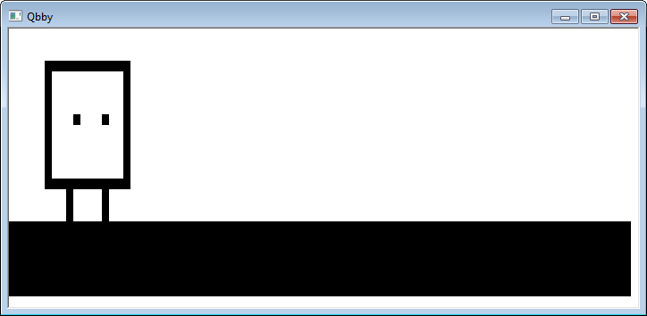

## Qbby

A small C# console program which prints an image of Qbby to the console.

## Why though?
I don't really know.

## What does MZG stand for?
**M**a**z**ey **G**raphics

## What's with the lines on the corners that are untouched?
At the moment I don't know how to write text there without cutting off another part of the console.
If you know how to do that, feel free to make a pull request.